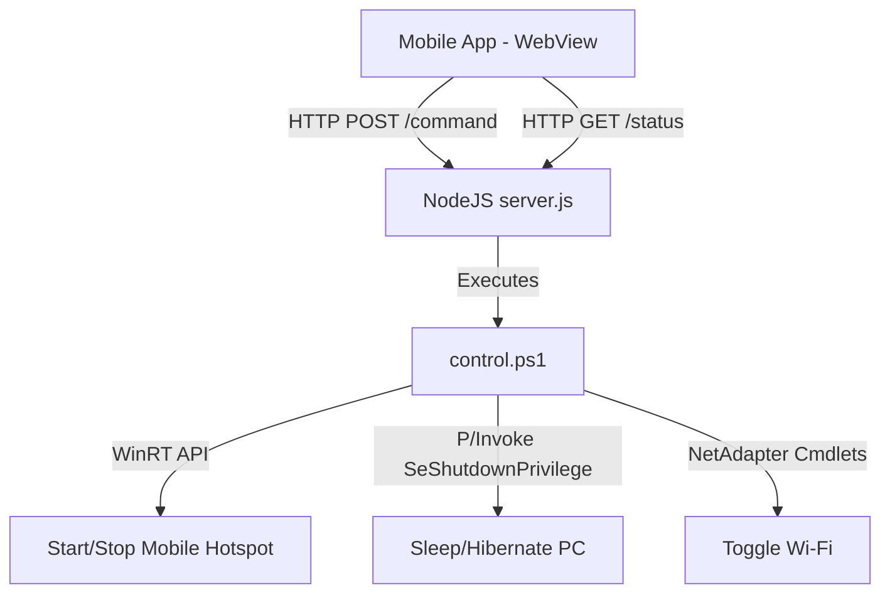

# Tailscale Remote System Controller

A lightweight, zero-trust remote control suite (Backend Daemon + Mobile Touch Web UI) designed to run exclusively across a private Tailscale overlay network. It allows you to toggle Wi-Fi, control a mobile hotspot, hibernate/sleep, and trigger shutdown timers on a Windows host machine directly from your Android phone.

---

## Architecture Overview



1. **Mobile Grid Dashboard** (`index.html` / `RemoteController-v1.0.7.apk`): 
   Loads inside a WebView on the mobile device, connecting to the host machine's persistent private Tailscale IP (starts with `100.`).
2. **Backend Daemon** (`server.js`):
   Binds strictly to the Tailscale IP and listens on port `8080`. Routes calls to a unified PowerShell controller.
3. **System Controller** (`control.ps1`):
   Handles all native Windows integration (Wi-Fi, Mobile Hotspot, Sleep/Hibernate) cleanly and securely.

---

## Prerequisites

*   **Host Machine**: Windows 10 or 11 with Node.js installed.
*   **Overlay Network**: Tailscale active on both your Windows host and your Android phone.
*   **Android Device**: Running Android 7.0 (API 24) or newer.

---

## Installation & Setup

### Step 1: Clone the Repository
Clone this repository to your target Windows machine:
```bash
git clone https://github.com/Yerevl/remote-ts.git
cd remote-ts
```

### Step 2: Configure Network Parameters
1. Find your Windows machine's Tailscale IP address (starts with `100.`).
2. Copy `config.example.json` and name it `config.json`:
   ```bash
   copy config.example.json config.json
   ```
3. Open `config.json` and replace `100.X.Y.Z` with your machine's Tailscale IP address:
   ```json
   {
     "ip": "100.95.148.41",
     "port": 8080
   }
   ```
   *(Note: `config.json` is ignored by Git, so your IP configuration stays local to your machine.)*

### Step 3: Register and Start the Daemon
To make the backend server run automatically in the background when your computer boots:
1. Right-click **`setup-admin-autostart.bat`** and select **Run as administrator**.
2. This script will register a Windows Scheduled Task named `TailscaleRemoteController` to run under the `SYSTEM` account on startup (no user login required).
3. The daemon starts running immediately in the background.

*To verify it is listening, you can inspect the newly created `server.log` file in the project folder.*

### Step 4: Install the Android App
*   **Quick Install**: Transfer the pre-built **`RemoteController-v1.0.7.apk`** from the root of this repository to your Android phone and install it.
*   **Compile from Source**: If you want to build it yourself, open the `remote-controller-app` directory in Android Studio (or run `./gradlew assembleDebug` via terminal) to compile your own APK.

---

## Custom Feature Implementations

### 1. Reliable Hibernate/Sleep in Session 0 (SYSTEM Account)
When running as a background service under the `SYSTEM` account, typical sleep methods fail due to lack of an active user session or missing process privileges. 

In `control.ps1`, this is solved by compiling an inline C# helper class (`PowerHelper`) that programmatically adjusts the current thread token to enable the `SeShutdownPrivilege` before executing the Win32 `SetSuspendState` function:
```powershell
[DllImport("advapi32.dll")]
public static extern bool OpenProcessToken(IntPtr h, int acc, ref IntPtr phtok);
[DllImport("advapi32.dll")]
public static extern bool AdjustTokenPrivileges(IntPtr htok, bool disall, ref TokPriv1Luid newst, int len, ...);
[DllImport("powrprof.dll")]
public static extern bool SetSuspendState(bool hibernate, bool forceCritical, bool disableWakeEvent);
```

### 2. WinRT Hotspot Control
Standard command-line tools like `netsh wlan hostednetwork` are deprecated on modern Wi-Fi adapters. We interface directly with the **Windows Runtime (WinRT)** APIs to manage the modern Mobile Hotspot safely and reliably:
```powershell
$tetheringManager = [Windows.Networking.NetworkOperators.NetworkOperatorTetheringManager, Windows.Networking.NetworkOperators, ContentType=WindowsRuntime]::CreateFromConnectionProfile($profile)
$tetheringManager.StartTetheringAsync()
$tetheringManager.StopTetheringAsync()
```

---

## Troubleshooting & Diagnostics

*   **Mobile App shows Offline**:
    1. Verify Tailscale is active and connected on both the phone and Windows PC.
    2. Open the Settings panel in the Android app (gear icon at the top right) and ensure the IP and Port matches your `config.json`.
*   **Viewing Server Logs**:
    Open the local `server.log` file in your repository. It tracks incoming commands, timestamps, and network statuses.
*   **Wi-Fi / Hotspot dependency**:
    The Mobile Hotspot requires your Wi-Fi adapter to be enabled. If you turn Wi-Fi OFF in the app, the mobile hotspot will automatically turn off.
