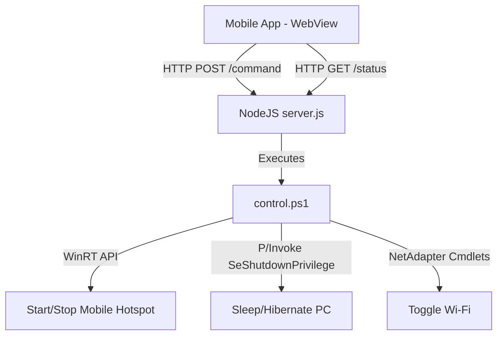

# Tailscale Remote System Controller

A lightweight, secure, and decoupled remote control suite (Backend Daemon + Mobile Touch Web UI) designed to run exclusively across a private Tailscale overlay network.

---

## Architecture Overview



1. **Mobile Grid Dashboard** (`index.html` / `RemoteController-v1.0.7.apk`): 
   Loads inside a WebView on the mobile device, connecting to the host machine's persistent private Tailscale IP (starts with `100.`).
2. **Backend Daemon** (`server.js`):
   Binds strictly to the Tailscale IP and listens on port `8080`. Routes calls to a unified PowerShell controller.
3. **System Controller** (`control.ps1`):
   Handles all native Windows integration (Wi-Fi, Mobile Hotspot, Sleep/Hibernate) cleanly and securely.

---

## File Structure

*   **[server.js](file:///C:/Tools/remote-ts/server.js)**: The HTTP backend daemon. Includes automatic logging to `server.log` and IP constraints.
*   **[control.ps1](file:///C:/Tools/remote-ts/control.ps1)**: The core Windows hardware connector. Toggles Wi-Fi, initiates clean hibernation, and manages the modern Windows hotspot.
*   **[setup-admin-autostart.bat](file:///C:/Tools/remote-ts/setup-admin-autostart.bat)**: An installer script. Run as Administrator to register the backend daemon to boot automatically on startup under the `SYSTEM` account.
*   **[index.html](file:///C:/Tools/remote-ts/index.html)**: The web UI served by the daemon.
*   **[RemoteController-v1.0.7.apk](file:///C:/Tools/remote-ts/RemoteController-v1.0.7.apk)**: The compiled Android application carrying the updated UI asset bundle.

---

## Custom Feature Implementations

### 1. Reliable Hibernate/Sleep in Session 0 (SYSTEM Account)
When running as a background service under the `SYSTEM` account, typical sleep methods fail due to lack of an active user session or missing process privileges. 

In `control.ps1`, this is solved by compiling an inline C# helper class (`PowerHelper`) that programmatically adjusts the current thread token to enable the `SeShutdownPrivilege` before executing the Win32 `SetSuspendState` function:
```powershell
[DllImport("advapi32.dll")]
public static extern bool OpenProcessToken(IntPtr h, int acc, ref IntPtr phtok);
[DllImport("advapi32.dll")]
public static extern bool AdjustTokenPrivileges(IntPtr htok, bool disall, ref TokPriv1Luid newst, int len, ...);
[DllImport("powrprof.dll")]
public static extern bool SetSuspendState(bool hibernate, bool forceCritical, bool disableWakeEvent);
```

### 2. WinRT Hotspot Control
Standard command-line tools like `netsh wlan hostednetwork` are deprecated on modern Wi-Fi adapters. We interface directly with the **Windows Runtime (WinRT)** APIs to manage the modern Mobile Hotspot safely and reliably:
```powershell
$tetheringManager = [Windows.Networking.NetworkOperators.NetworkOperatorTetheringManager, Windows.Networking.NetworkOperators, ContentType=WindowsRuntime]::CreateFromConnectionProfile($profile)
$tetheringManager.StartTetheringAsync()
$tetheringManager.StopTetheringAsync()
```

---

## Troubleshooting & Maintenance

### To update the background service:
If you make changes to `server.js` or `control.ps1`, right-click **[setup-admin-autostart.bat](file:///C:/Tools/remote-ts/setup-admin-autostart.bat)** and choose **Run as administrator**. This automatically stops the old daemon instance, updates the startup schedule, and restarts the backend immediately.

### To view backend log output:
Open **[server.log](file:///C:/Tools/remote-ts/server.log)** in the project directory. All commands dispatched from the phone and system status checks are logged with timestamps.

### Hardware Dependency:
The Mobile Hotspot requires your Wi-Fi adapter to be active. If you toggle Wi-Fi OFF in the app, the mobile hotspot will automatically turn off.
